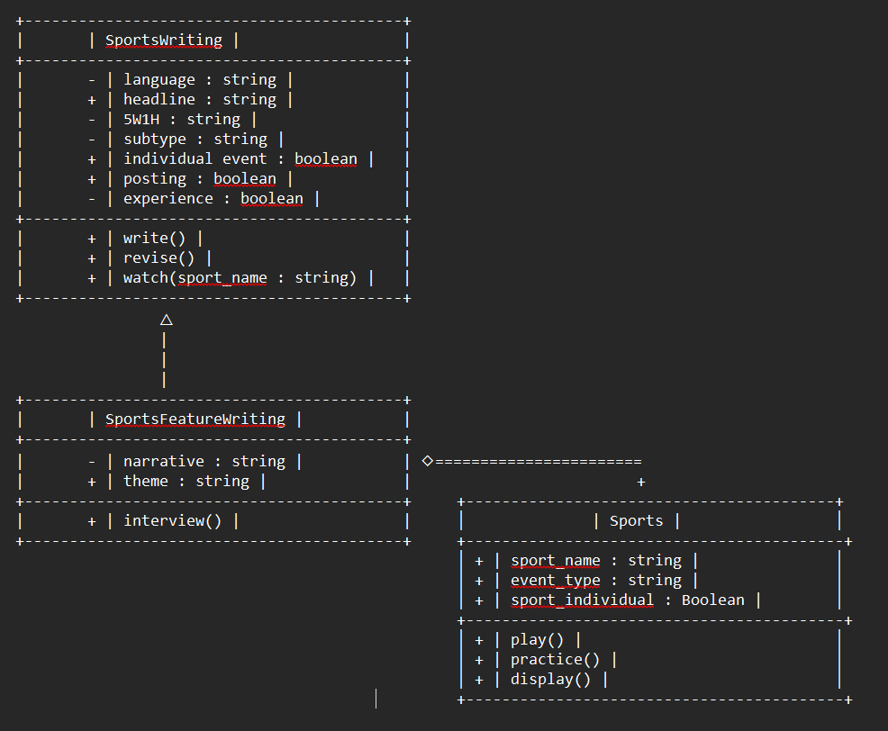
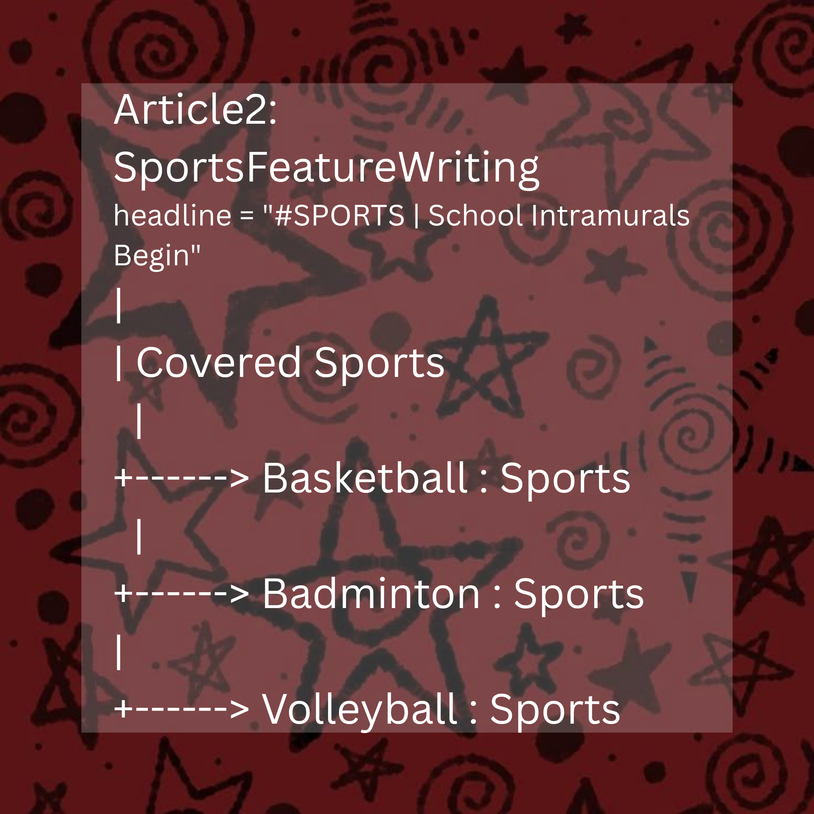

# Advanced Class Relationships

## Previous Activities
[classAttrib](classAttributesMethods.md)
[classRel](classRelationships.md)

## Existing System Description:
Currently, my system consists of two classes, namely SportsWriting and Sports, The first class, SportsWriting, handles the details needed for a sports article, such as the language used, headline, facts, subtype, and more. Sports on the other hand handles the specifics of the sports played and covered in the article, which includes attributes like its name, event type, and how many players there are.

Although both of these classes contain attributes that go into the specifics, I believe it is still too generalized. Sports Writing is a very diverse field, which means it can cover many things. Although a subtype attribute is contained within the SportsWriting class, it is quite limiting. It uses a lot of if/else statements, which make sthe code quite repetitive. By creating a child based on the specific subtypes, the system can be cleaner, less repetitive, and easier to manage.

## Inheritance Relationship
Parent: SportsWriting
Child: SportsFeatureWriting
Explanation: A Sports Feature article is a real sports article subtype that focuses on connecting sports to the human interest by adding depth and a creative twist to it.

## Inheritance UML
[Inheritance](images/inheritanceDiagram.png)

## Composition/Aggregation
Relationship: Aggregation
Explanation: A Sport can exist even without a sport article to cover it.

## Advanced UML Diagram

## Python Implementation
[Source Code](advancedRelationships.py)

## Test Run
[Test](images/advancedTestRun.txt)

## Object Diagram

## Reflection
## Why did you choose your inheritance relationship? Explain why your child class is a type of your parent class.

I chose this inheritance relationship because feature writing is anotehr category of campus journalism that is also very dear to me. Although I have never personally tried it, the way it is able to connect writing with the authenticity of humans is fascinating. Sports Feature is also a real type of sports article, so it makes sense that it would be a child of Sports Writing. It reuses the attributes of the parent class, such as the language, headline, facts, and more, but it also adds its own attributes like theme and narrative.

## How did inheritance reduce duplicate code? Identify attributes or methods that were reused.
As seen in my code, all the attributes and methods from SportsWriting except for watch() were used in SportsFeatureWriting. Instead of copying or retyping everything, the child class inherited the attributes of the parent class through the use of the super() function. This allowed me to reduce the amount of duplicate code.

## Why is your HAS-A relationship Composition or Aggregation? Explain the lifecycle relationship
between the two objects.
Aggregation is the relationship between the objects Article2 and Sports1, Sports2, and Sports3. I chose this relationship because even if Article 2 were to be deleted, the sports objects would still be there. The three sports objects are independent from the article. It was created on its own then later added in th elist inside Article2. If Article2 were to be deleted, the list would be too, but the sports objects would still exist.

## What is the difference between Association from Part III and the advanced relationship you
implemented?
Due to the 1..* multiplicty between Sports and SportsWriting that required me to create a list, I realized that I already implemented an aggregation relationship between the two classes in Part III. Though I did not notice it at the time due to my lack of knowledge, I believed that the relationship between the two objects was an association. I believe that now, the main difference between the association from the previous part to the avacned relationship now is that it is now reffered to its proper name, aggregation.

## How does your design follow the DRY principle?
In my design, I was able to follow the DRY principle in two ways. I did it by first, reusing the attributes and methods from the parent class using the super() function. This allowed me to reduce the amount of duplicate code I would have written. Second, by having a class dedicated to Sports, I was able to avoid having duplicate sport variables inside my code.
