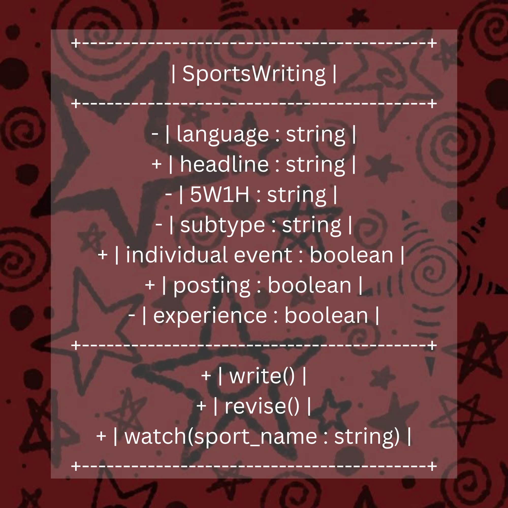
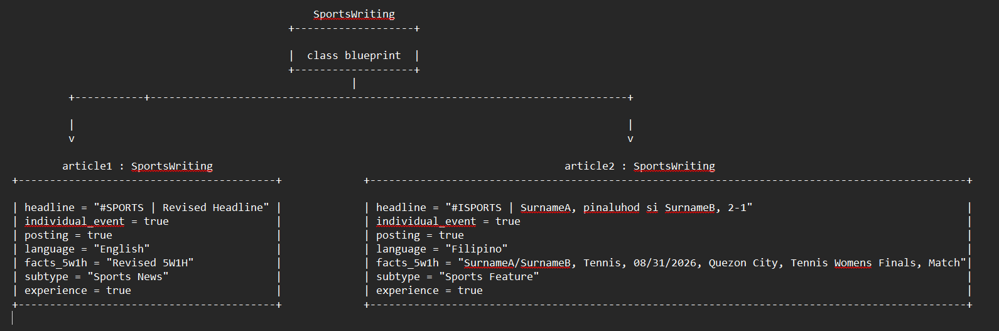

# Class Attributes and Methods
## Previous Design
Link to my previous activity:
[classObjectUML.md](classObjectUML.md)
## Design Revision

I did not make any major changes. I only rewrote the defition of the methods.

## Visibility Decisions
| Attribute | Data Type | Visibility | Reason |
|---|---|---|---|
| language | string | Private | The language should be fixed even before parts of the article are written. |
| headline | string | Public | The headline can be seen by anyone |
| 5W1H | string | Private | This is specific information that is used as the basis for most of the article, so it should not be something easy to tamper with. |
| subtype | string | Private | Like the language, the type of sports article should be fixed beforehand. |
| individual event | boolean | Public | It can be something used for reference. |
| posting | boolean | Public | Even if it's not for posting, articles are allowed to be something that can be viewed freely |
| experience | boolean | Private | It depends entirely on the writer. |

## Updated UML Class Diagram

## Python Implementation

[View Python Source](classImplementation.py)

## Test Run
[Test Run](images/classTestRun.txt)

## Object Diagram

## Analysis
### Why did you make your chosen attribute private?
I decided to make the properties language, 5W1H, subtype, and experience private because these are things that shouldn't be easily messed with. All of these excepy for experience are core parts of the article, and it would be quite bad if these could be changed easily. The language is the backbone of the entire article as it provides the medium of writing. The subtype and 5W1H is what guides the writer throughout the article. The experience is the writer's personal background.

### Which method changes the state of your object?
The methodS write() and revise() change the state of my object. write() provides the input for the (initial) headline and 5W1H, while revise() allows the user to change the original values of headline and 5W1H, along with the subtype. Say that the original values of the attributes are blank (=""), write() and revise() give them values.

### How did your two objects demonstrate that instances are independent?
As seen in my test run, I changed the headline and 5W1H of article1 using the revise() method, and after displaying the attributes of both articles, it was seen that only the values of article1 changed. The two objects are separate from one another, and changing the values of one will not change the value of the other, so for instance when I changed article1's headline from "#SPORTS | Team A crushes Team B, 2-0" to "#SPORTS | Revised Headline", article2's headline still stayed as it is. This is because of the pillar of encapsulation. 

### What is the difference between your class diagram and your object diagram?
The class diagram shows the names of the attributes and methods along with their visibility, whilst the object diagram shows the values of the object's attributes. As evident in their names "class"Diagram and "object"Diagram, the first provides a diagram of the objects. The second one is a diagram of the objects.