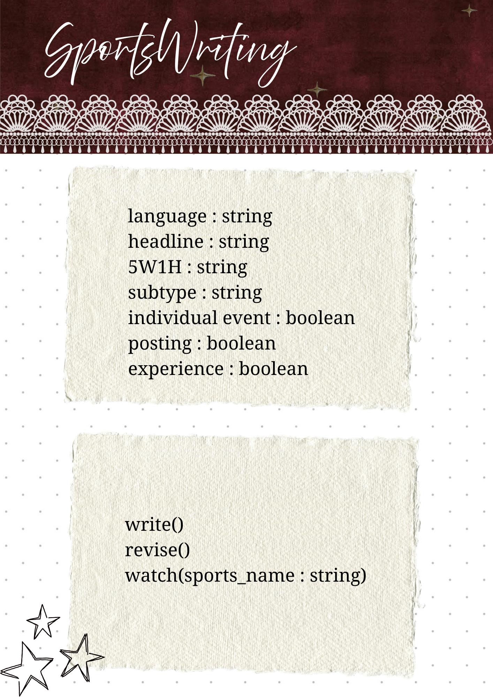

# SG4 - Understanding Classes and Objects

**Name:** Jenelle Ysabel C. Ramirez
**Section:** 9 - Platinum
**Last Name:** Ramirez
**Date:** 09/03/26

--

# SG4 - Understanding Classes and Objects
## Context

Campus Journalism

## Class

SportsWriting

## Class Description

Sports Article Information and Essentials

## Properties
| Property | Data Type | Description |
|---|---|---|
| language | string | Language of Article (ex; English or Filipino) |
| headline | string | Headline of the Article |
| 5W1H | string | Who, What, Where, When, Why, and How of the situation |
| subtype | string | Article Subtype (ex; Sports News, Sports Feature) |
| individual event | boolean | If event in press conference is indivdual or not (Collaborative) |
| posting | boolean | If article is for posting on school publication/facebook page |
| experience | boolean | Confirms if journalist has had prior experience competing or not |

## Methods
| Method | Description |
|---|---|
| write() | Write the article |
| revise() | Revise the Article
| watch(sports_name; string) | Watch Videos for Facts Sheet |

## Class Diagram

## Design Explanation
### Why did you choose this class?
I chose this class because journalism and sports writing are things that possesses a great importance in my life. I've always loved writing, and being given the opportunity to start campus journalism in the 6th grade definitely taught me a lot about different writing styles and also discipline. 
### Which property is the most important? Why?
I belive that the most important property here would be language. This is becasue you can't really start writing if you don't have a language to write it in. It'd be a waste of time to write an article in english only to figure out you were supposed to write in Filipino, and vice versa.
### Which method is the most useful? Why?
The most useful method here would be watch(). Unlike other journalism categories, sports writers are not given their own fact sheets and instead they collect data by watching an actual game. With wacth(), we are able to watch a game so we are able to cover something for our article.