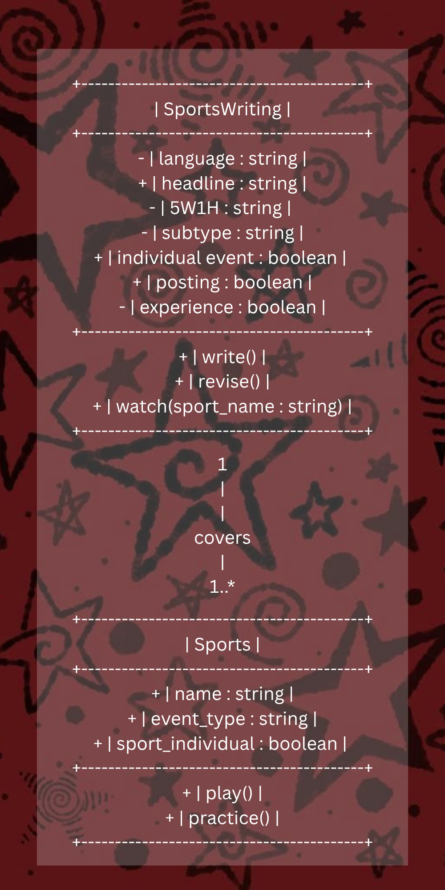
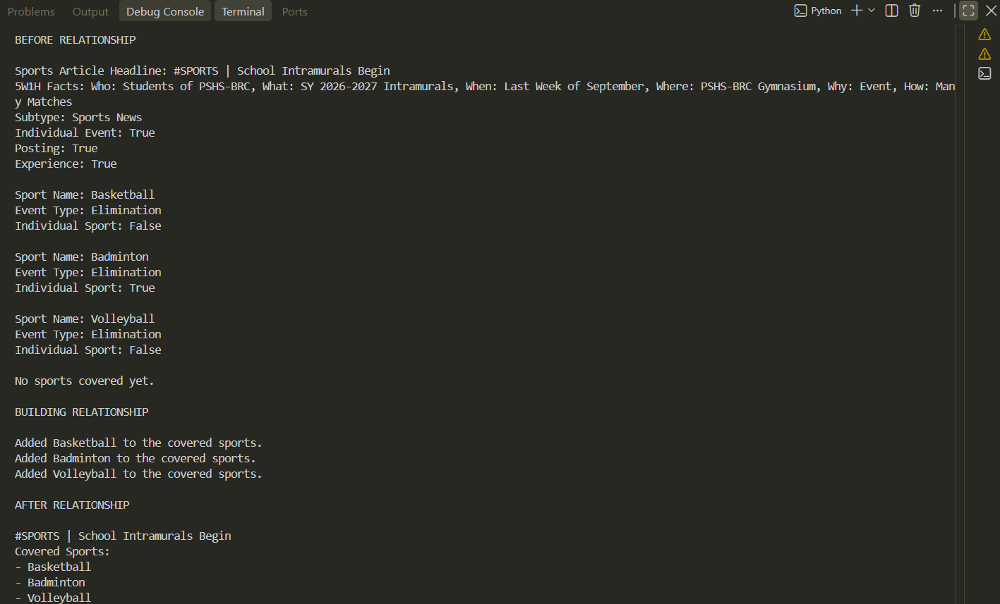

# Class Relationships: Association and Multiplicity

## Previous Work
[Part I - Classes and Objects](classObjectUML.md)
[Part II - Class Attributes and Methods](classAttributesMethods.md)

## Existing Class
Class: SportsWriting

Description: This class represents the sports writing category of campus journalism. It contains the basic properties that would be needed when writing an article.

## New Related Class
Class: Sports
Description: This class represents the diverse world of sports. It contains the basic properties that every sport would have.

## Association
Relationship: SportsWriting covers Sports
Explanation: Sports Writing is based off of sports. Unlike other journalism categories where their facts are based off of the latest news or similar things, sports writing needs a sport to cover for it to be written. It is its topic. Without it, no sports article can be written.
## Multiplicity

Multiplicity: 1..*
Explanation: Sports Writing is very broad. When it comes to play-by-play article, an article only covers one sport. However, as mentioned earlier, sports writing's broadness and diversity can also allow for it to cover multiple sports if it is what the article is asking for. For example, if a writer were to be asked to create a Sports News article talking about Intramurals, it could include numerous sports. 

## UML Class Relationship Diagram

## Python Implementation
[View Python Source](classRelationships.py)

## Test Run

## Object Relationship Diagram

## Analysis

### What is the association between your two classes?

The two objects share a HAS(-A) relationship, though I used the term "covers" here. The object from SportsWriting() covers one or more Sports() objects. Though the objects from both classes are independent, the Sports objects are later associated to SportsWriting.

### What multiplicity did you choose and why?

I chose the 1..* multiplicity. As explained earlier, I chose this because in the real world logic of sports writing, the Sport is its topic. Without a sport, a sports article can not be created. Though, since sports writing is very diverse, it an also cover more than one sport, as seen in my code with the Article topic being the opening of the school's Intramurals.

### How did you implement the relationship in Python?

I implemented the relationship in python by creating a private list inside SportsWriting (self.__covered_sport = []) to store the Sports object/s that would later be instantiated in it. I was able to instantiate the Sports object by creating the function add_sport that would append the created sports object into the covered_sport list.

### Why did you store an object reference instead of copying its data?

I stored an object reference instead of copying the data because of a few reasons. First, it would be a waste of Computer memory to keep creating objects if it would just be copy-pasted instead. So much time and effort could've been saved if the same object that was created was also the one used inside the code. Second, it is more accurate. We do not know what errors could occur while copy-pasting, and instantiating the actual object can avoid said errors at it reflects the very info that we were trying to copy.

### If your relationship uses many, why is a list appropriate?

A list in python is used to store multiple values in a single variable. In the case where the relationship between the two is many, a list can prevent the creation of multiple variables for each object, which could be very time consuming, as opposed to a list where all that is needed is to append the object into the list. It also keeps it much more organizd at it keeps te values in one single place. 